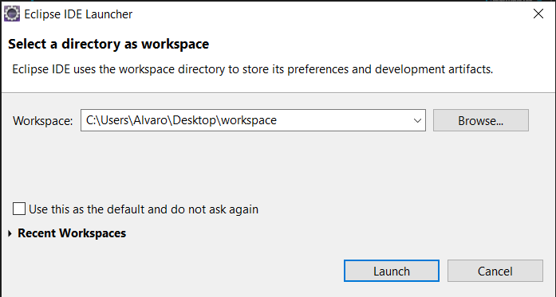

# Santander Tutorial

## **Pasos previos**

**SI QUIERES EMPEZAR DE 0 BORRA LAS CARPETAS *BACKEND* Y *FRONTEND***

1. Clona el repositorio:
   > git clone https://github.com/alvarodelaflor/santander-tutorial

2. Instala angular en la carpeta actual, en concreto usaremos la versión 11:
   > npm install -g @angular/cli@^11

## **Get Started With Spring Boot (Backend)**

El primer paso que tenemos que realizar es crear un proyecto Spring Boot base, para ello nos dirigimos a [Spring Initializr]() y crearemos nuestro proyecto plantilla con los requisitos que se nos marquen.

Por ejemplo podría ser un proyecto Maven, con la versión 2.3.1 de Spring Boot, con packaging jar y Java 11.

Una vez seleccionemos todas las características, pulsaremos en el botón *GENERATE* y se nos descargará un archivo *.zip* .

Este archivo lo extraemos en nuestra carpeta principal y lo renombramos a **backend**. Hasta este momento deberíamos tener algo así:

Ya tenemos un primer proyecto. El siguiente paso es abrir eclipse (o tu IDE favorito de desarrollo) para comenzar a trabajar con él. Vamos a ello.

Al abrir Eclipse, lo primero que nos pide es crear un espacio de trabajo, en nuestro caso lo hemos configurado de la siguiente forma:

Ya tenemos configurado el espacio de trabajo, el siguiente paso es importar nuestro proyecto **Maven** plantilla.

> File > Import... > Maven > Existing Maven Projects > Next

Y en la ventana que que nos aparece seleccionamos el la carpeta que renombramos anteriormente.

Pulsamos en **Finish** y se habrá importado nuestro proyecto.

Deberá salir algo tal y como la imagen anterior, sin ningún tipo de Warnings ni errores. En caso contrario habrá que echarle un vistazo a ver que problema ocurre. Recuerda que debes tener instalado el JDK 11 de Java en tu equipo.

Vamos a comprobar que nuestro proyecto arranca:

1. Botón derecho sobre nuestro proyecto
2. Run as > Maven Build

3. En goals introducimos spring-boot:run
4. Pulsamos en Apply y luego en Run
   

Cuando termine, la build debe haber sido correcta.

